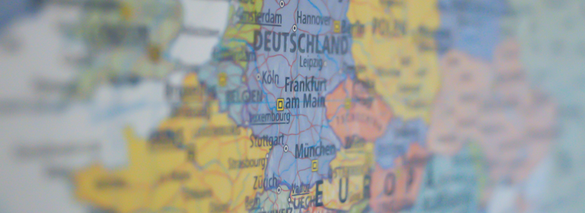

# Cost Abroad

A tool for visualising information about the relative day-to-day costs of visiting different countries in Europe.

The cost of things like food, accommodation, and transport varies widely between European countries. So getting a simple overview of these differences in map form can help with planning trips and budgeting when travelling on holiday or business.

Data is drawn from Eurostat's price level indices (PLIs), which are based on a country's purchasing power parity divided by its current nominal exchange rate. PLIs are not intended to rank countries strictly, but provide a good indication of the order of magnitude of the price level in one country in relation to others.

The latest version can be viewed [here](https://www.costabroad.co.uk/ "Cost Abroad").
